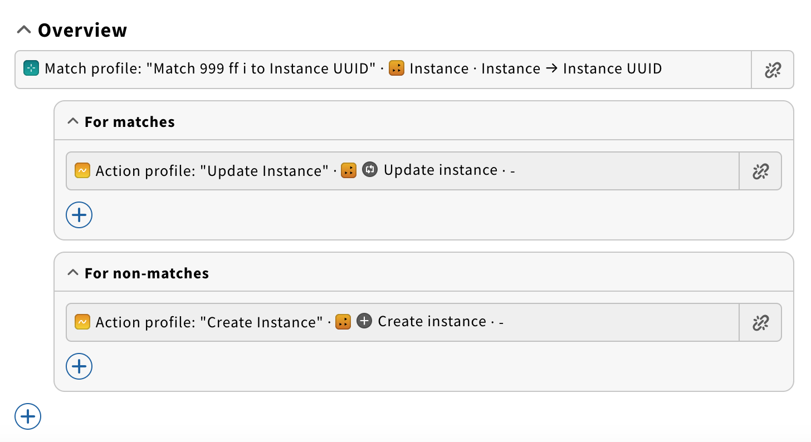
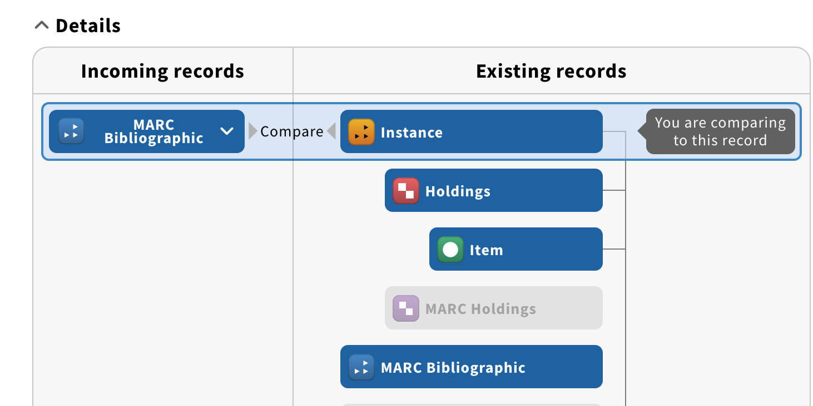
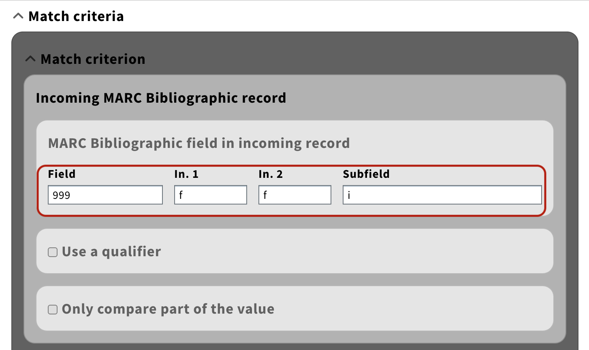
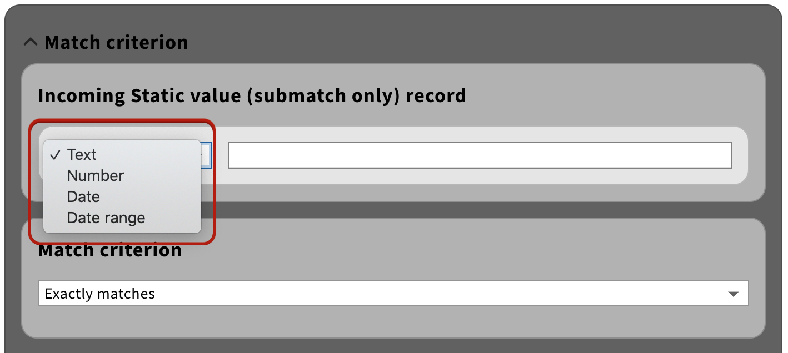
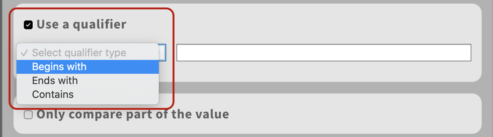
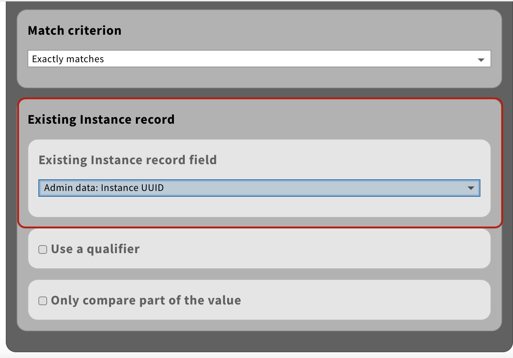
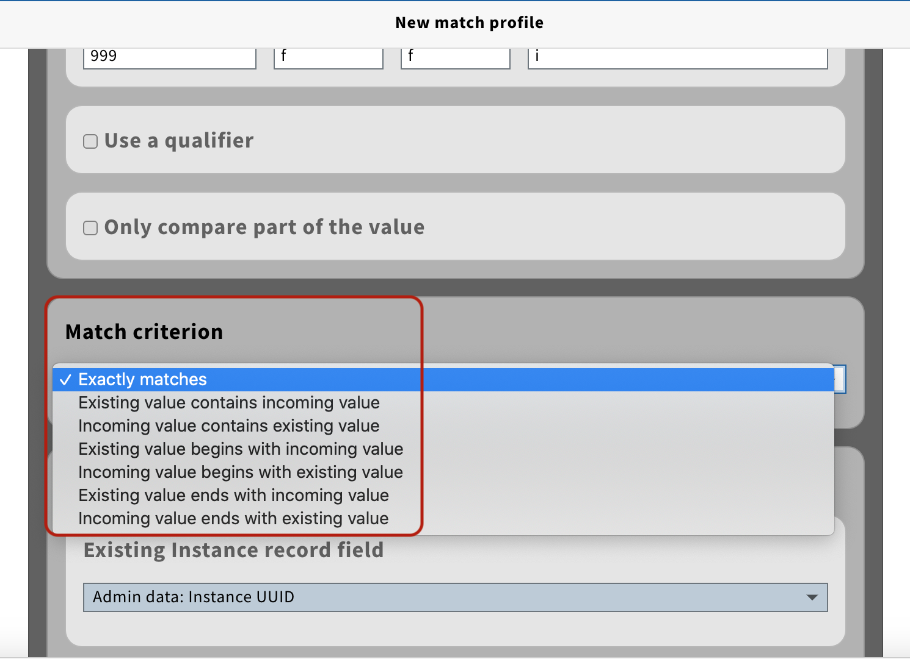

# data-import-processing-core

Copyright (C) 2019 The Open Library Foundation

This software is distributed under the terms of the Apache License,
Version 2.0. See the file "[LICENSE](LICENSE)" for more information.

## Introduction

Core infrastructure for event processing for the DataImport.

## Match Engine

**Match Engine** is an abstract name for a functionality allowing for processing of the [MatchProfile](https://github.com/folio-org/data-import-raml-storage/blob/master/examples/mod-data-import-converter-storage/matchProfile.sample) logic of the data-import JobProfile.
Based on match results (MATCH or NON_MATCH) JobProfile processing flow can be branched.
Basically, matching is used for searching for a Record, on which a particular action should be applied. If such Record is found, actions specified "for matches" are executed, if not - "for non-matches" actions are performed.

Match Engine consists of a number of components. The actual process of matching is invoked by calling match() method of the **MatchingManager**:

`MatchingManager.match(dataImportEventPayload)`

MatchingManager accepts [DataImportEventPayload](https://github.com/folio-org/data-import-raml-storage/blob/master/examples/mod-data-import/dataImportEventPayload.sample),
from which it extracts [MatchProfile](https://github.com/folio-org/data-import-raml-storage/blob/master/examples/mod-data-import-converter-storage/matchProfile.sample) and all the necessary information to perform matching.

The idea of matching is essentially a comparison of a particular value from incoming Record to the specified field of an existing one

To extract value from incoming Record a particular implementation of **MatchValueReader** is applied.
data-import-processing-core library currently contains implementation for reading values from MARC Bibliographic records:

There is also an implementation of a Reader for STATIC_VALUES (please note that match on static fields can only be used as a sub-match in a JobProfile):

MatchValueReader also applies [Qualifier](https://github.com/folio-org/data-import-raml-storage/blob/master/schemas/mod-data-import-converter-storage/match-profile-detail/qualifierType.json) and [Comparison part](https://github.com/folio-org/data-import-raml-storage/blob/master/schemas/mod-data-import-converter-storage/match-profile-detail/comparisonPartType.json) to the value (based on the [MatchExpression](https://github.com/folio-org/data-import-raml-storage/blob/master/schemas/mod-data-import-converter-storage/match-profile-detail/matchExpression.json) for incoming Record specified in the MatchProfile)

The extracted value from incoming Record is then matched against a particular field of an existing one:

To find (load) that existing Record - **MatchValueLoader** is used.

The implementation of MatchValueLoaders lies on the module, in which data-import processing is happening.

In order to allow MatchingManager to build MatchValueReader and MatchValueLoader (based on incoming and existing record types) one should register the appropriate implementations in MatchValueReaderFactory and MatchValueLoaderFactory respectively:

`MatchValueReaderFactory.register(new MarcValueReaderImpl());`

`MatchValueLoaderFactory.register(new InstanceLoader(storage, vertx));`

MatchingManager calls **Matcher** to perform the match itself.
Matcher uses **LoadQueryBuilder** to build a **LoadQuery** based on the value (extracted from incoming Record by MatchValueReader) and [MatchDetails](https://github.com/folio-org/data-import-raml-storage/blob/master/schemas/mod-data-import-converter-storage/match-profile-detail/matchDetail.json) specified in the profile.

LoadQueryBuilder supports building queries for String, List (multiple String values from incoming Record, like 035 field values from MARC Bibliographic records) and Date value types.

Resulting LoadQuery contains a CQL and SQL queries, that can be used by a particular MatchValueLoader implementation to find an entity.
SQL queries are suited for modules that have direct access to the db (mod-*-storage ones), while CQL queries are designed to be used in the business logic modules (like mod-inventory, since mod-inventory does not have the access to the db, it can only retrieve the entity from mod-inventory-storage via API, narrowing down the search with CQL).

The actual query is built based on the [MatchExpression](https://github.com/folio-org/data-import-raml-storage/blob/master/schemas/mod-data-import-converter-storage/match-profile-detail/matchExpression.json) for existing Record, which is extracted from the MatchDetails of the MatchProfile.
LoadQueryBuilder uses QueryHolder implementation for constructing basic query based on [MatchCriterion](https://github.com/folio-org/data-import-raml-storage/blob/master/schemas/mod-data-import-converter-storage/match-profile-detail/criterionType.json)

It then applies [Qualifier](https://github.com/folio-org/data-import-raml-storage/blob/master/schemas/mod-data-import-converter-storage/match-profile-detail/qualifierType.json) and [Comparison part](https://github.com/folio-org/data-import-raml-storage/blob/master/schemas/mod-data-import-converter-storage/match-profile-detail/comparisonPartType.json) (see examples for incoming Record) to the query.

MatchValueLoader searches for an entity based on the constructed LoadQuery.
If entity with specified conditions is found, MATCH is considered successful, matched entity is saved to [DataImportEventPayload](https://github.com/folio-org/data-import-raml-storage/blob/master/examples/mod-data-import/dataImportEventPayload.sample) context
and actions for MATCH branch of the JobProfile are applied to that entity. If not - actions for NON_MATCH branch of the JobProfile are executed.
Multiple matches are not supported, in case multiple Records satisfy query conditions, an error is emitted and no action is performed.

## Additional information

* See project [MODDICORE](https://issues.folio.org/browse/MODDICORE)
at the [FOLIO issue tracker](https://dev.folio.org/guidelines/issue-tracker).

* Other FOLIO Developer documentation is at [dev.folio.org](https://dev.folio.org/)
